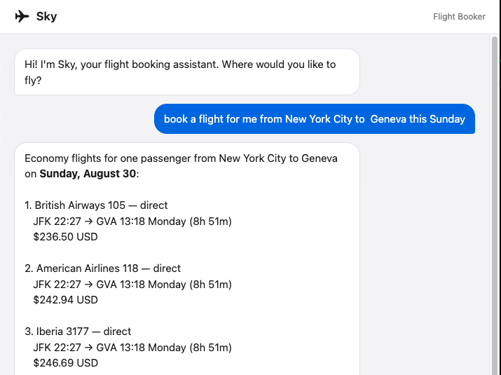
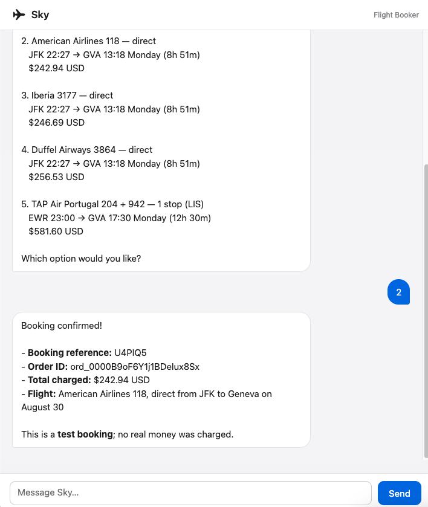

# flight-booker

A Harpe agent named **Sky** that searches for flights and places bookings via the [Duffel API](https://duffel.com/docs) (test mode). Runs as a local web app.

## What it does

1. User describes a trip in chat (e.g. "I need a flight from London to New York on October 1st")
2. Sky searches Duffel for the cheapest options and presents them
3. User picks a flight; Sky collects passenger details conversationally
4. Sky shows a booking summary and asks for confirmation
5. On confirmation, Sky places the order and returns the booking reference (PNR)

All bookings use Duffel's sandbox — no real flights, no real charges.

## Setup

**1. Get a Duffel test API key**

Sign up at [app.duffel.com](https://app.duffel.com), go to **Developers → API keys**, and create a key starting with `duffel_test_`.

**2. Configure**

```sh
cp .env.example .env
```

Fill in `.env` with at minimum:

```
DUFFEL_API_KEY=duffel_test_<your key>
ANTHROPIC_API_KEY=<your key>
```

**3. Create the project and install dependencies**

```sh
jo new my-booker --template typescope/harpe:flight-booker
cd my-booker
pip install -r requirements.txt
```

## Running

**Start**

```sh
jo web
```

Then open [http://127.0.0.1:8765](http://127.0.0.1:8765) in your browser.

When Sky is ready to book a flight it shows a confirmation card in the chat — approve or reject it directly in the page.

**Configuration** (optional, `.env`)

```
HOST=127.0.0.1   # default
PORT=8765        # default
```

See [Create a Flight Booking Agent](https://harpe.typescope.ai/tutorial/create-flight-booking-agent/) for how the approval boundary works.


## Agent App snapshot




