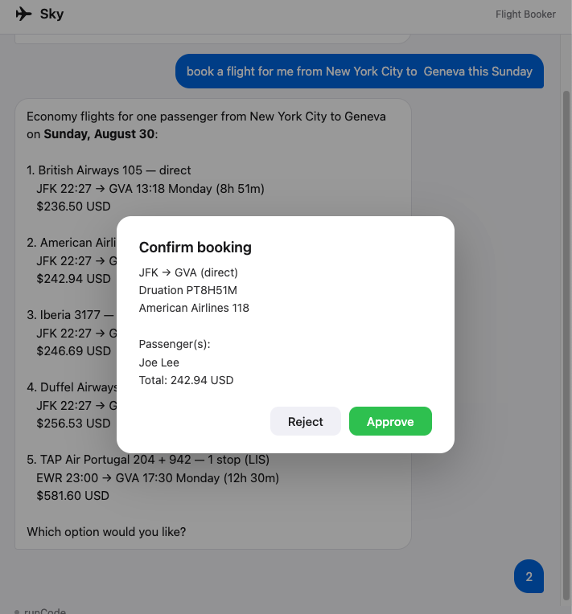

# flight-booker

Searches for flights and places bookings through the
[Duffel API](https://duffel.com/docs), in a local web app. It asks the user to
confirm before it books, which is the irreversible step.

It runs in Duffel test mode: searches and bookings hit sandbox data, no real
money is charged, and booking references are test PNRs.

## Setup

```sh
pip install -r requirements.txt
cp .env.example .env
```

In `.env`:

- `DUFFEL_API_KEY` — a test key from [app.duffel.com](https://app.duffel.com),
  under Developers → API keys. It starts with `duffel_test_`.
- `MODEL` and one provider key: `ANTHROPIC_API_KEY` or `OPENAI_API_KEY`
- `HOST` and `PORT` are optional and default to `127.0.0.1` and `8765`

## Running

```sh
jo start
```

Then open <http://127.0.0.1:8765>. When the agent is ready to book it shows a
confirmation card in the chat — approve or reject it there.

## Layout

- `AGENT.md` — the system prompt
- `src/` — the driver: server, sessions, the approval interaction
- `assets/` — the chat page
- `sandbox/` — the Duffel capability
- `skills/` — reference the model can read

[Flight Booking](https://harpe.typescope.ai/case-studies/flight-booker/) walks
through how the approval boundary works.

## Screenshots





